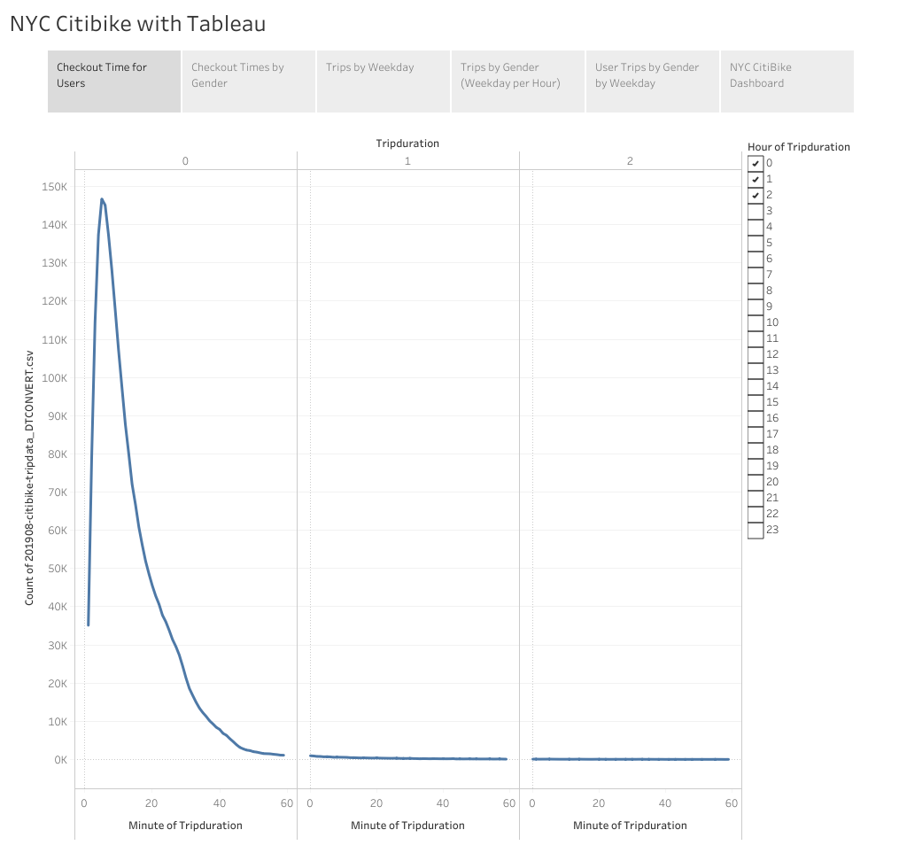
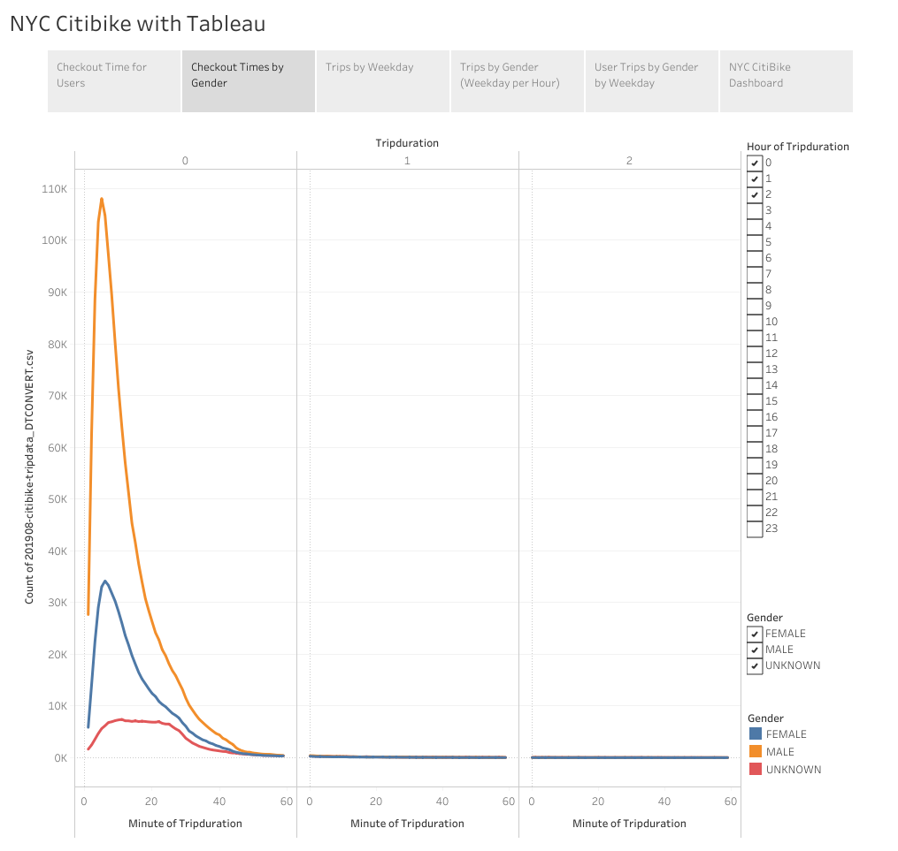
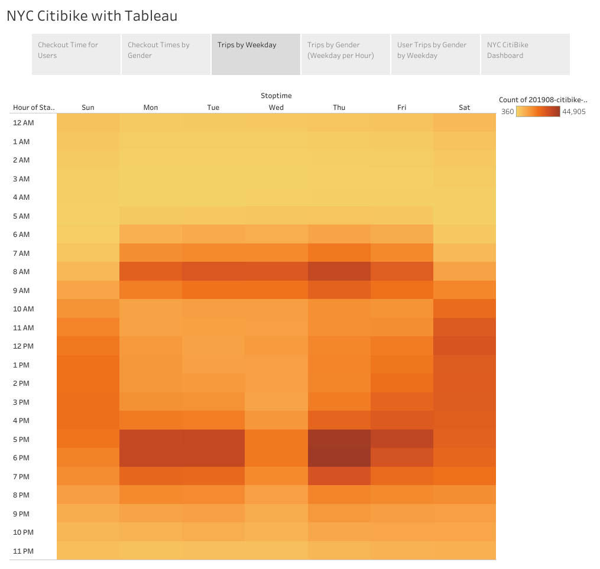
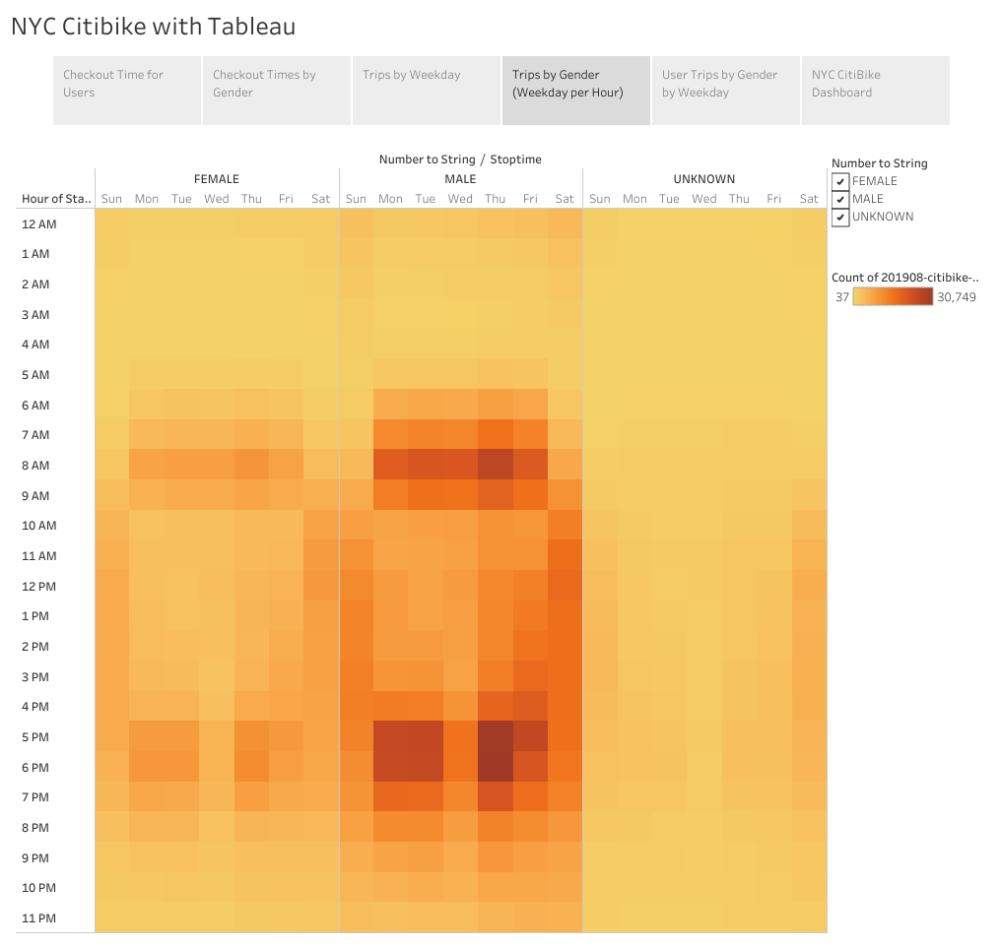
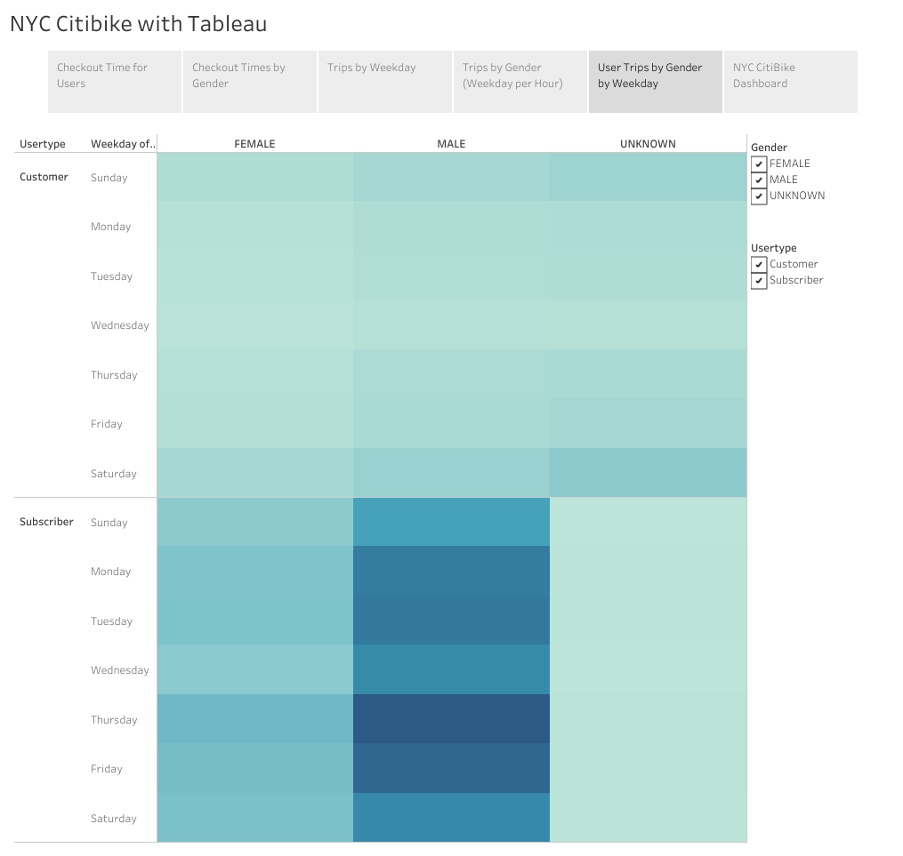
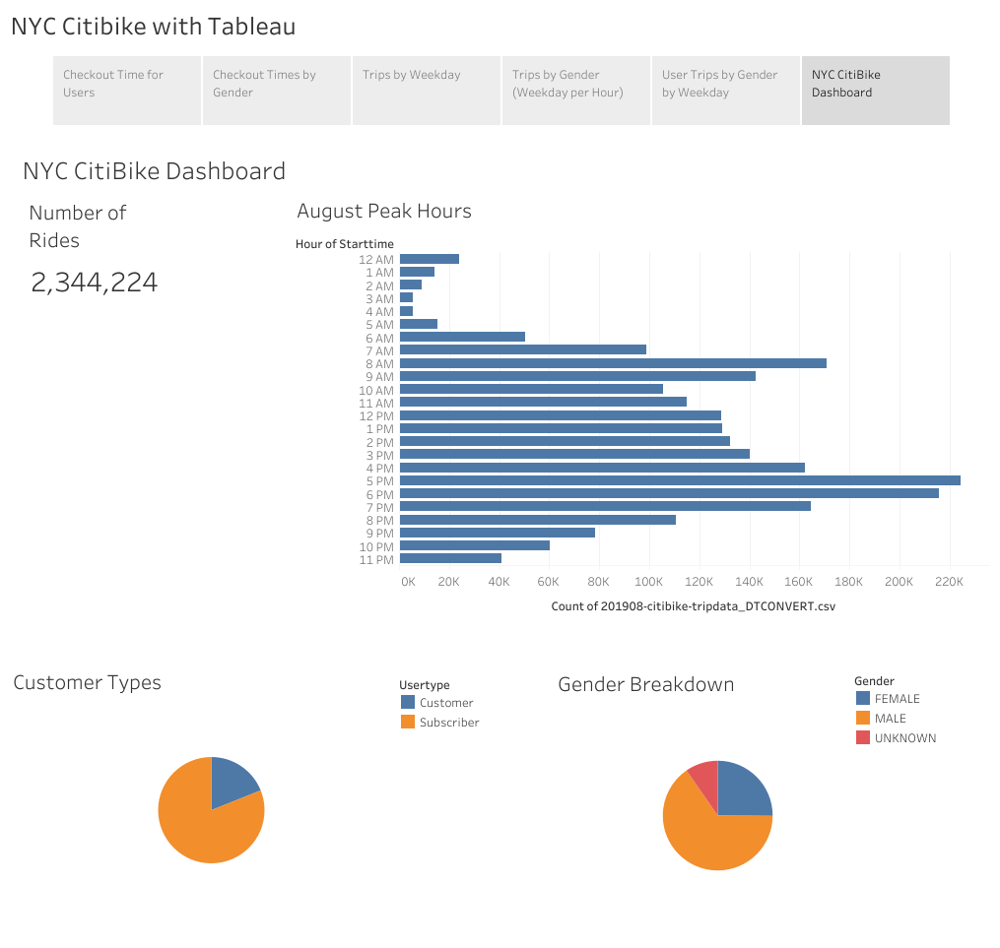
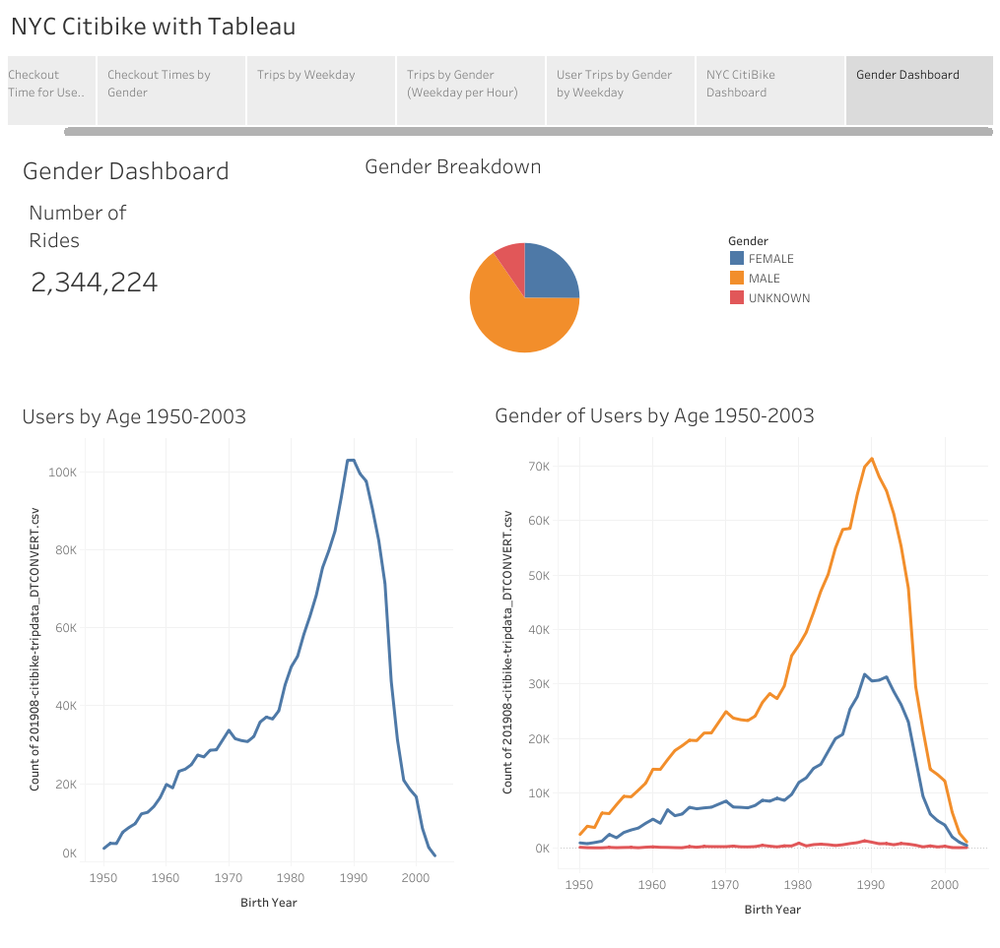

# Module 14 - NY Citibike with Tableau

## Overview of the analysis:
Client requests additional analysis of the bike trip data. This analysis will consist of:
- modifying the data set using Pandas to change the data type of the "tripduration" column.
- Show the length of time that bikes are checked out for all riders and genders
- Show the number of bike trips for all riders and genders for each hour of each day of the week
- Show the number of bike trips for each type of user and gender for each day of the week.

## Results:
---
Using the visualizations you have in your Tableau Story, describe the results of each visualization underneath the image:
---

Checkout time for users is generally less than one out and on average peaks at 5 minutes.
---

Men are the primary users bikes and checkout time tracks with overall checkout times.
---

Peak use is commute hours at 8 AM and 4:30-6:30 PM.
---

Men are the primary users during the peak use times.
---

Peak use days is during the work week.
---

Dashboard shows total number of rides, peak hours, breakdown of Customer Type and Gender Breakdowns.
---

## Summary:
---
Provide a high-level summary of the results and two additional visualizations that you would perform with the given dataset.
---

Dashboard shows total number of rides, peak hours, Gender Breakdowns, and two additional vizualizations that illustration the population of users by year of birth, and an additional breakdown of gender and year of birth.
